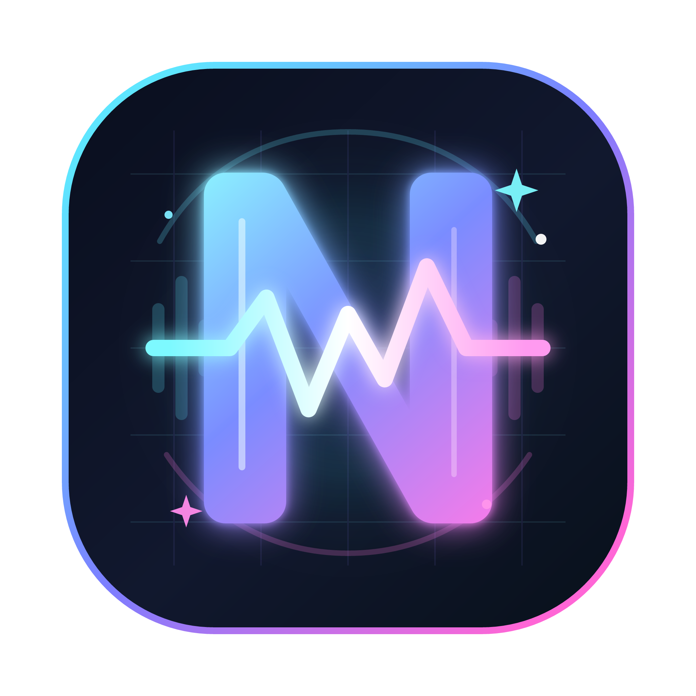
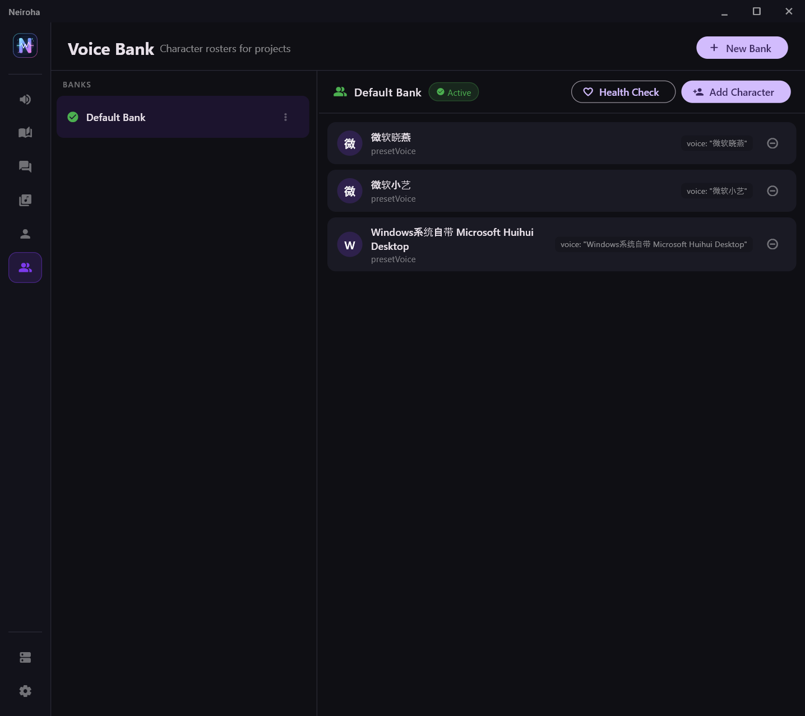
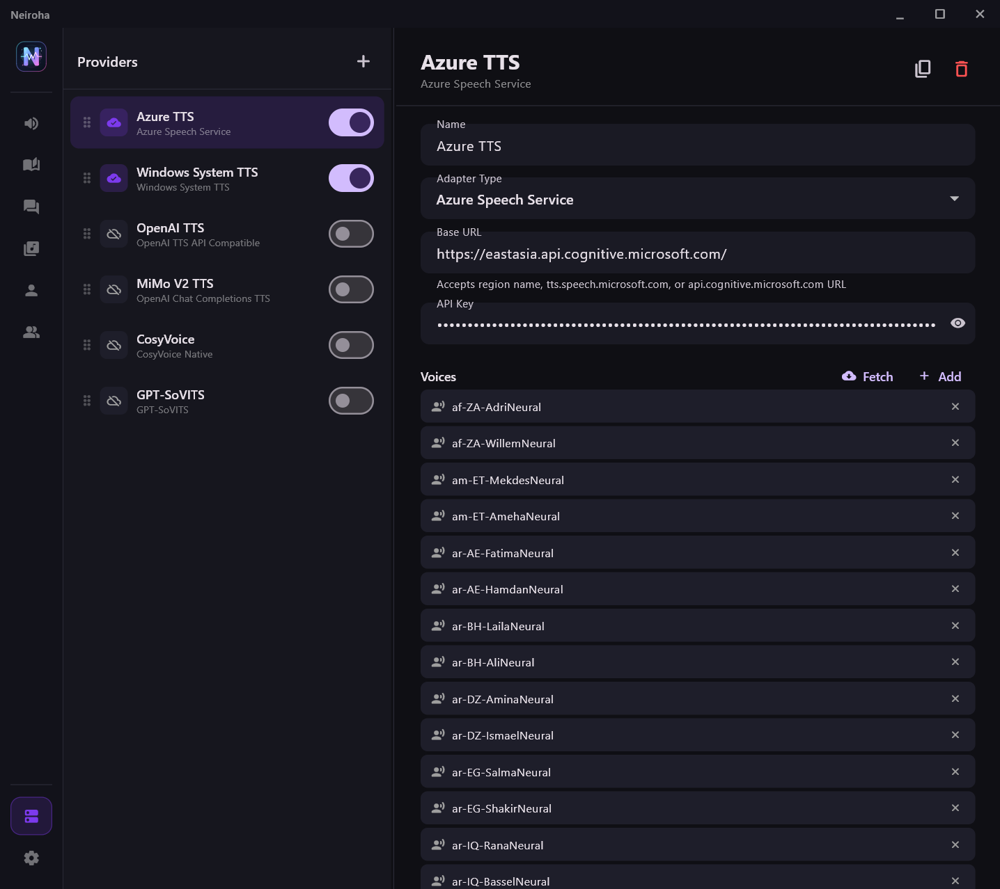
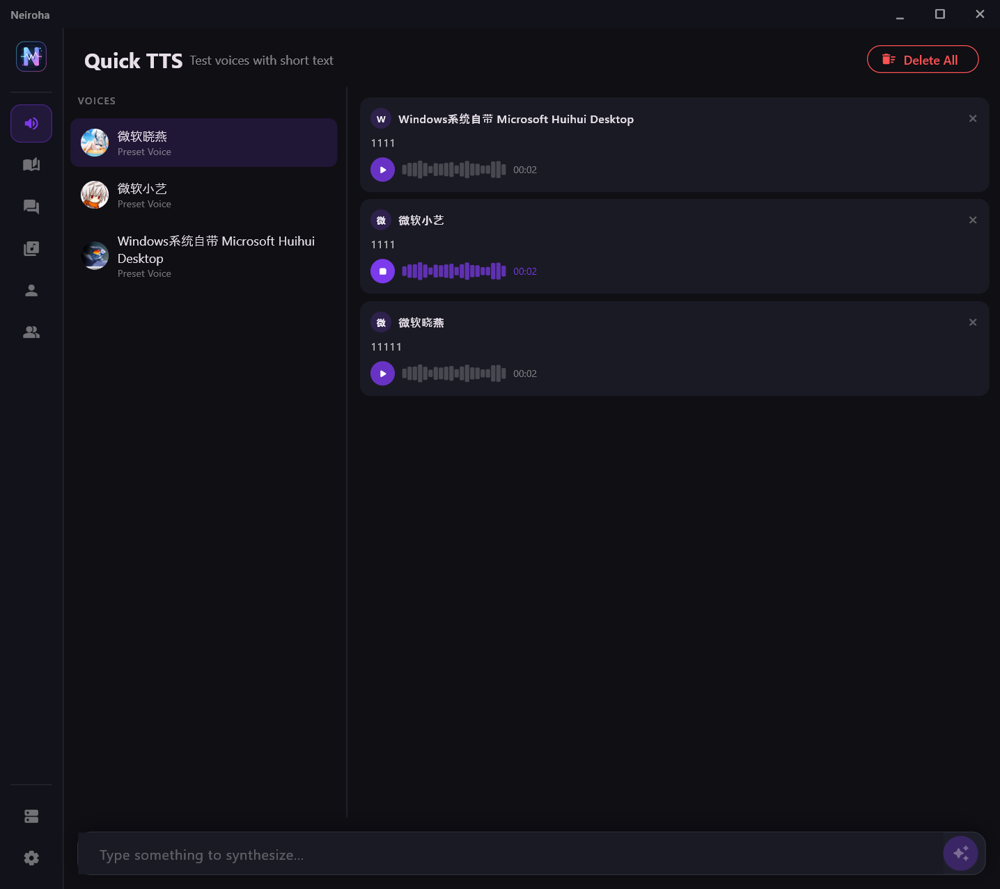
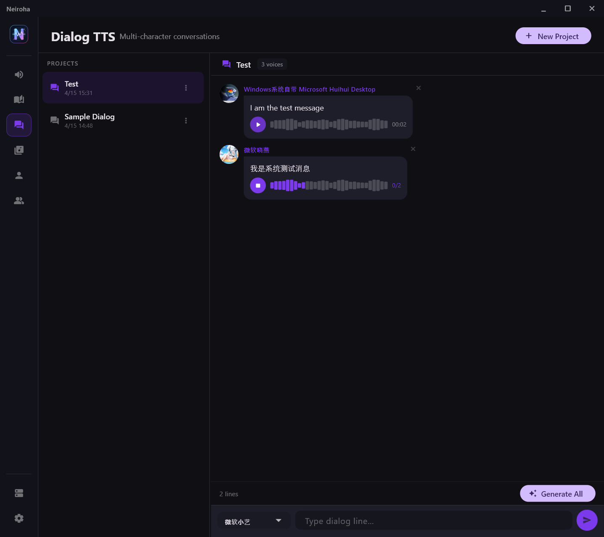

<div align="center">



# Neiroha

**AI Audio Middleware & Dubbing Workstation**

[](https://flutter.dev)
[](https://github.com/flutter/flutter)
[](https://github.com/Neiroha/Neiroha/releases)
[](https://github.com/Neiroha/Neiroha/releases)
[](LICENSE)

[English](README.md) · [中文](README_zh.md)

</div>

---

<div align="center">
  
</div>

## What is Neiroha?

Neiroha is a **Flutter desktop application for Windows** that acts as a universal front-end for multiple text-to-speech engines. It lets you:

- Connect to any combination of TTS backends (cloud or local) through a single unified interface.
- Build a library of named **Voice Characters** — each character binds a specific provider, voice, speed, and optional reference audio.
- Organise characters into **Voice Banks** and switch between them per project.
- Produce speech through a built-in **OpenAI-compatible HTTP API**, so any tool that speaks the OpenAI TTS protocol can talk to Neiroha without modification.
- Work across production modes from one-shot testing to long-form reading and video dubbing: **Quick TTS**, **Dialog TTS**, **Phase TTS**, **Novel Reader**, and **Video Dub**.
- Monitor current synthesis work from Settings, including queued/running TTS tasks and API request logs.

---

## Feature Overview

| Section | What it does |
|---|---|
| **Providers** | Connect to TTS backends (OpenAI, Azure, GPT-SoVITS, CosyVoice, System TTS, …) |
| **Voice Characters** | Define characters with a chosen provider, voice/model, speed, and reference audio |
| **Voice Banks** | Group characters into banks; activate a bank to make it available across all screens |
| **Quick TTS** | One-shot test: pick a character, type text, generate & play instantly |
| **Dialog TTS** | Multi-character conversation projects with Telegram-style chat view |
| **Phase TTS** | Long-form narration: paste a script, split into segments, batch-generate |
| **Novel Reader** | Import TXT/folders, read long novels with cached TTS, prefetch, auto-advance and persistent playback |
| **Video Dub** | Import video/audio/subtitles, generate TTS for cues, arrange media on a lightweight timeline and export |
| **Tasks** | Inspect current queued/running TTS work, provider limits and recent failures from Settings |
| **API Server** | Local OpenAI-compatible HTTP server with loopback default, optional API key, CORS, rate limits and logs |
| **Storage / Media Tools** | Manage voice-asset root, missing-file scan, audio archive cleanup, FFmpeg detection and export defaults |

---

## Getting Started

### Requirements

- Flutter SDK ≥ 3.11
- Windows 10/11 (primary target)
- At least one TTS backend reachable on your network or localhost

### Run from source

```bash
flutter pub get
dart run build_runner build --delete-conflicting-outputs
flutter run -d windows
```

---

## Step-by-Step Usage

### 1. Configure a Provider

Go to the **Providers** tab in the sidebar.

Click **+** (top-right of the list pane) → choose a name and adapter type:

| Adapter | When to use |
|---|---|
| **OpenAI TTS API Compatible** | OpenAI, KoboldCpp, Kokoro/XTTS via OpenedAI-speech, Orpheus, etc. |
| **Azure Speech Service** | Microsoft Azure Cognitive Services TTS |
| **GPT-SoVITS** | Local GPT-SoVITS server (v2 API) |
| **CosyVoice Native** | Local CosyVoice inference server |
| **VoxCPM2 Native** | Local VoxCPM2 inference server |
| **OpenAI Chat Completions TTS** | Models that emit audio via the chat completions endpoint |
| **Google Gemini TTS** | Google AI Studio Gemini TTS models |
| **Windows System TTS** | Windows SAPI voices — no server needed |

Fill in the fields for the selected provider:

- **Base URL** — e.g. `http://localhost:8880/v1` for a local OpenAI-compatible server, or `eastus` / `https://eastus.tts.speech.microsoft.com` for Azure.
- **API Key** — leave blank if your server doesn't require one.
- **Default Model Name** — for GPT-SoVITS / CosyVoice; ignored for Azure/System TTS.

Click **Fetch** (or **Fetch All**) to pull the available models/voices from the provider and cache them locally. You can also add entries manually with **+ Add**.

Click **Save**, then flip the toggle on the provider row to **enable** it. Run **Health Check** to confirm connectivity.

<div align="center">
  
</div>

---

### 2. Create Voice Characters

Go to the **Voice Bank** tab, select or create a bank, then click **New Character**.

Fill in:

- **Name** — display name shown throughout the app.
- **Provider** — select an enabled provider.
- **Task Mode** — determines which fields appear:
  - *Preset Voice* — pick a voice from the provider's voice list (e.g. `alloy`, `en-US-AriaNeural`).
  - *Voice Clone with Prompt* — upload a reference audio clip + prompt text for models that support voice cloning (GPT-SoVITS, CosyVoice).
  - *Voice Design* — free-form instruction sent to models that accept a `voice_instruction` (e.g. MiMo v2 TTS, chat-completions TTS).
- **Speed** — synthesis speed multiplier (0.5 – 2.0).
- **Avatar** — optional image shown in chat bubbles.

Click **Save Character**.

---

### 3. Build a Voice Bank

Go to the **Voice Bank** tab.

Click **+ New Bank** → give it a name → then add characters by creating them directly in the selected bank or importing existing characters from another bank.

Click **Set Active** on the bank you want to use. The active bank is the default voice pool for project creation and API voice/model listing.

---

### 4. Quick TTS

Quick TTS is available from the **Voice Bank** character inspector. Select a bank and a character, then use the quick test panel above the character settings.

1. Select a character in the current bank.
2. Type text in the quick test input.
3. Click the generate button. Audio is synthesised through the shared queue, saved to disk, and played back automatically.
4. Generated takes are saved into the Quick TTS archive for reuse and storage scans.

<div align="center">
  
</div>

---

### 5. Dialog TTS

Go to the **Dialog TTS** tab. This screen is for producing multi-character audio like game dialogue or dub scripts.

#### Create a project

Click **New Project** → enter a name and choose a Voice Bank → click **Create**.

#### Add dialog lines

In the input bar (bottom of the right pane):

1. Pick a character from the **Voice** dropdown.
2. Type the line text.
3. Click **Send** (→). The line appears as a chat bubble.

Repeat for each line, switching characters as needed.

#### Generate audio

Click **Generate All** to synthesise every line that has no audio yet. Lines are processed in order; errors are shown as a red badge on the bubble.

Click ▶ on any bubble to play its audio. The waveform animates with a progress indicator and elapsed/total time.

<div align="center">
  
</div>

---

### 6. Phase TTS

Go to the **Phase TTS** tab. This screen is for long narrations or audiobook-style content.

1. **Create a project** → paste your full script into the text area.
2. Use the **Split** button to divide the script into segments (splits on blank lines or sentence boundaries).
3. Review and edit individual segments.
4. Click **Generate All** to batch-synthesise every segment using the characters assigned to each one.
5. Export or copy the resulting audio files from the output directory shown in the status bar.

---

### 7. Novel Reader

Go to the **Novel Reader** tab for long-form TXT reading and cached TTS playback.

1. Create or import a novel project from a TXT file or folder.
2. Choose narrator/dialogue voices from the project's Voice Bank.
3. Configure slicing, punctuation-only skipping, prefetch count, auto-turn-page and auto-advance behavior.
4. Press play: the reader generates missing audio, caches it on disk, and prefetches upcoming segments through the shared TTS queue.
5. Keep **Settings → General → Keep TTS Running Across Screens** enabled if you want the novel to continue reading while you inspect tasks or settings.

Provider concurrency applies to Novel Reader generation, but the reader can only run as many workers as there are pending prefetch targets. Set the reader's prefetch/ahead count at least as high as the provider concurrency, and make sure RPM/TPM limits are not throttling it.

---

### 8. Video Dub

Go to the **Video Dub** tab to produce TTS-backed video dubbing projects.

1. Create a project and select a Voice Bank.
2. Import a video to V1; its original audio is linked on A1.
3. Import SRT/LRC subtitles, then generate TTS for cues.
4. Move cues and imported audio on the timeline, use sync-length tools when generated speech needs to match subtitle windows, and preview against the video.
5. Export audio or a dubbed video using the FFmpeg settings configured under **Settings → Media Tools**.

Video Dub is intentionally scoped as a single-video dubber. It is not meant to replace a full NLE, but it covers the common subtitle-to-TTS workflow.

---

### 9. Settings, Tasks and Storage

The **Settings** tab is split into focused sections:

- **General** — startup tab and whether TTS should continue when switching screens.
- **Tasks** — current running/queued TTS tasks plus recent completed/failed work.
- **API Server** — bind address, port, API key, CORS allowlist, rate limit, body limit and API log output.
- **Storage** — voice-asset root, missing-file scan and audio archive cleanup.
- **Media Tools** — FFmpeg detection plus default audio/video export settings.

The task view reflects the process-wide TTS scheduler used by Quick TTS, Dialog TTS, Phase TTS, Novel Reader, Video Dub and the local API server.

---

### 10. API Server

Neiroha exposes a local HTTP server so external tools (games, DAWs, scripts) can call TTS via a standard OpenAI-compatible interface.

#### Start the server

Open **Settings → API Server** and toggle the server on. The default bind address is **127.0.0.1** and the default port is **8976**, so a fresh install is loopback-only. Set the bind host to `0.0.0.0` only when you intentionally want LAN access.

Security and access controls:

- Optional API key via `Authorization: Bearer <key>` or `X-API-Key: <key>`.
- CORS origin allowlist for browser clients.
- Per-IP request budget and max request body size.
- Optional in-app API log output in Settings; request bodies and auth headers are not logged.

#### Endpoints

| Method | Path | Description |
|---|---|---|
| `POST` | `/v1/audio/speech` | Synthesise speech (OpenAI-compatible) |
| `GET` | `/v1/audio/voices` | List available voice characters |
| `GET` | `/v1/models` | List available providers/models |
| `GET` | `/speakers` | Alias for voices list |
| `GET` | `/health` | Health check — returns `{"status":"ok"}` |

#### Example request

```bash
curl http://localhost:8976/v1/audio/speech \
  -H "Content-Type: application/json" \
  -d '{
    "model": "Default Bank",
    "voice": "Default Voice",
    "input": "Hello, world!",
    "response_format": "wav",
    "speed": 1.0
  }' \
  --output hello.wav
```

**Fields:**

| Field | Type | Required | Notes |
|---|---|---|---|
| `input` | string | yes | Text to synthesise |
| `voice` | string | yes | Character name as configured in Voice Characters |
| `model` | string | no | Voice Bank name to scope the voice lookup; omit to search globally |
| `response_format` | string | no | `wav` (default), `mp3`, `ogg`, `opus`, `pcm` |
| `speed` | number | no | 0.5 – 2.0, default `1.0` |

The response body is the raw audio bytes with the appropriate `Content-Type` header.

---

## Supported Provider Reference

### OpenAI TTS API Compatible

Works with any server that implements `POST /v1/audio/speech`.

```
Base URL: http://localhost:8880/v1
API Key:  (server-specific, or blank)
Model:    tts-1  (or tts-1-hd, kokoro, etc.)
```

### OpenAI Chat Completions TTS

Works with any model that returns audio via the Chat Completions endpoint (e.g. MiMo v2 TTS).

### Azure Speech Service

```
Base URL: eastus              ← bare region name
          — OR —
          https://eastus.tts.speech.microsoft.com
API Key:  <Ocp-Apim-Subscription-Key>
```

Use **Fetch** to pull the full list of Azure Neural voices (~400+). Pick one as the preset voice on your character.

### GPT-SoVITS

```
Base URL: http://127.0.0.1:9880
```

Set **Default Model Name** to the GPT-SoVITS model path or leave blank to use the server default. Characters should use *Voice Clone with Prompt* mode, with a reference `.wav` and matching transcript text.
Related repo: [GPT-SoVITS](https://github.com/RVC-Boss/GPT-SoVITS)

### CosyVoice

```
Base URL: http://127.0.0.1:9880
```

Compatible with the CosyVoice inference server. Users need to upload audio to configure the voice cloning service. See [CosyVoiceDesktop](https://github.com/Moeary/CosyVoiceDesktop) for a companion GUI.

### VoxCPM2 Native

```
Base URL: http://127.0.0.1:8000
```

Compatible with local VoxCPM2-style inference servers. Characters can use reference audio and optional voice instructions when supported by the backend.

### Google Gemini TTS

```
Base URL: https://generativelanguage.googleapis.com
Model:    gemini-2.5-flash-preview-tts
```

Uses Google AI Studio Gemini TTS models. Configure the API key on the provider and use preset voices or instruction-style voice control depending on the model.

### Windows System TTS

No URL or key required. Fetches installed SAPI voices automatically. Characters use *Preset Voice* mode.

---

## Data Storage

All settings, characters, banks, and history are stored in a SQLite database at:

```
%APPDATA%\com.neiroha.neiroha\neiroha.db
```

Generated audio files are stored under:

```
%APPDATA%\com.neiroha.neiroha\voice_asset\quick_tts\        ← Quick TTS outputs
%APPDATA%\com.neiroha.neiroha\voice_asset\phase_tts\        ← Phase TTS outputs
%APPDATA%\com.neiroha.neiroha\voice_asset\dialog_tts\       ← Dialog TTS outputs
%APPDATA%\com.neiroha.neiroha\voice_asset\novel_reader\     ← Novel Reader cache
%APPDATA%\com.neiroha.neiroha\voice_asset\video_dub\        ← Video Dub generated media
%APPDATA%\com.neiroha.neiroha\voice_asset\voice_character_ref\ ← Reference audio
```

The voice-asset root can be changed from **Settings → Storage**. Neiroha keeps stable per-project and per-character folder slugs so renaming display names does not move existing audio.

---

## Troubleshooting

| Symptom | Fix |
|---|---|
| Health Check fails | Verify the Base URL is reachable and the API key is correct |
| No voices shown in Quick TTS | Activate a Voice Bank that contains at least one enabled character |
| Audio plays but shows `--:--` duration | Normal on first play — duration updates automatically after the first playback |
| Provider concurrency appears unused in Novel Reader | Increase Novel Reader prefetch/ahead count and check RPM/TPM limits |
| API server unreachable from another machine | Bind host defaults to `127.0.0.1`; use `0.0.0.0` intentionally and configure an API key |
| `Platform channel threading` warning in logs | Fixed in this build — temporary AudioPlayer instances are no longer created |
