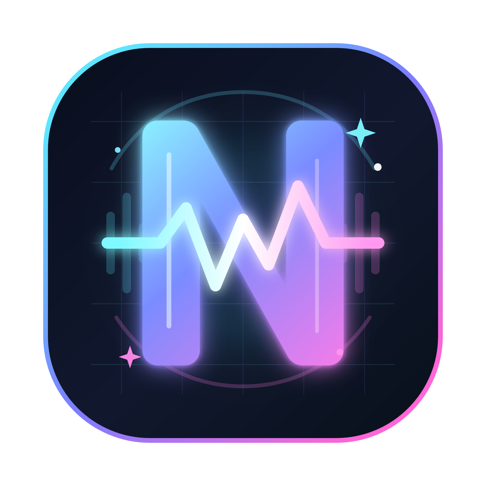
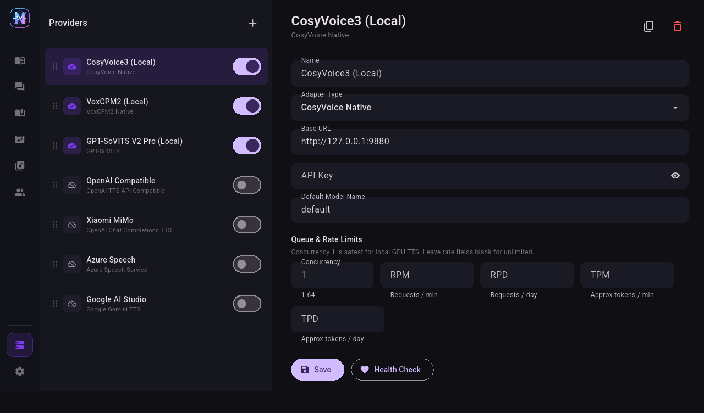
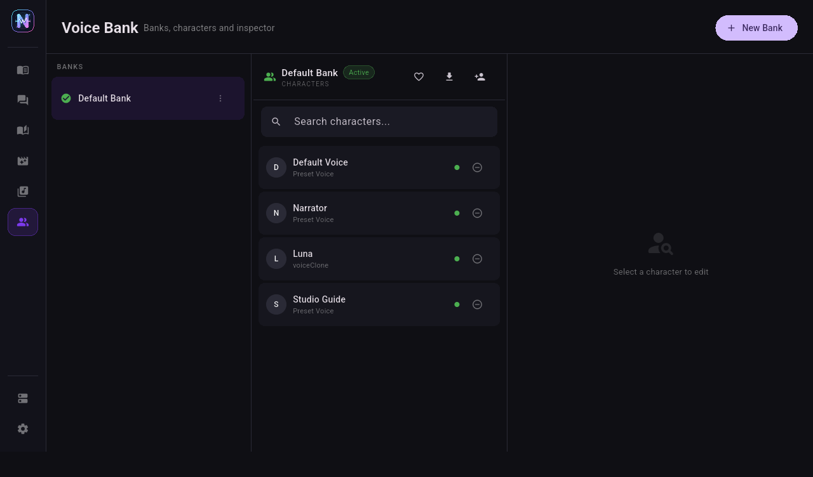
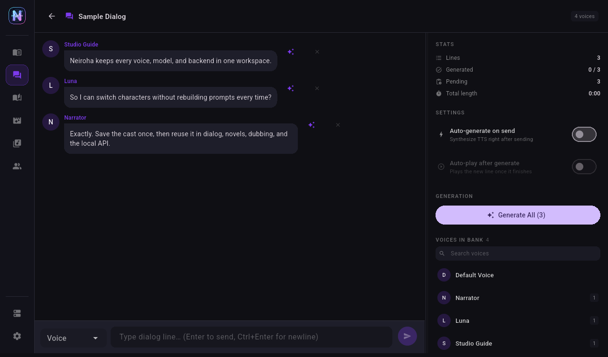
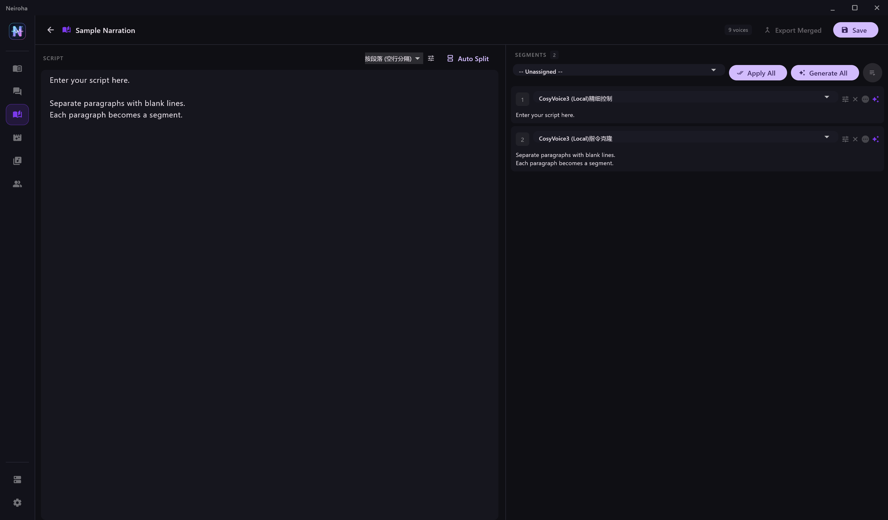
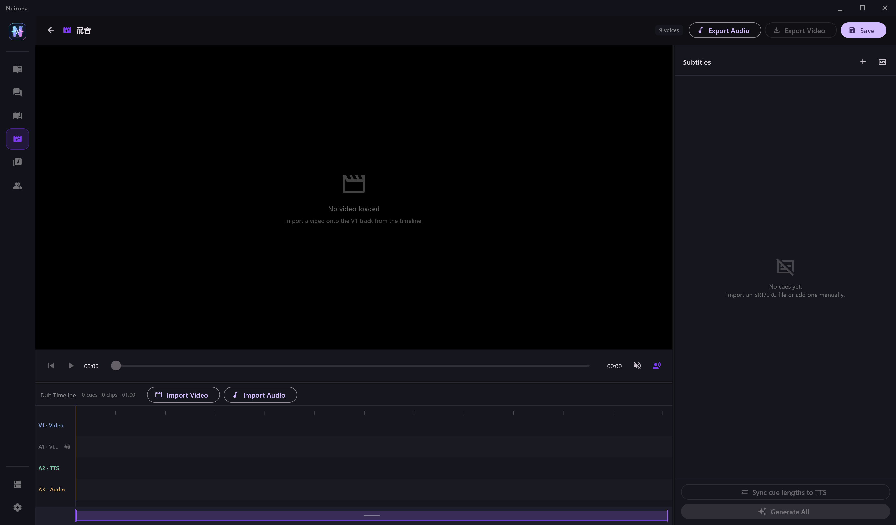

# Neiroha

**AI Audio Middleware & Dubbing Workstation**

[English](README.md) · [中文](README_zh.md) · [Wiki](https://neiroha.github.io/en/) · [API](docs/api.md)

---

## One Workstation For AI Voice Production

Neiroha is a Flutter app for creators who need many character voices, multiple TTS engines, long-form generation, and dubbing projects. It is not just another prompt box; it turns scattered scripts, web UIs, local inference servers, and media folders into a repeatable production workflow.

It brings local inference wrappers, cloud speech APIs, voice cloning, reusable voice characters, voice banks, long-form narration, dialog generation, video dubbing, and a local OpenAI-compatible API into one operator surface.

## Why Use It

| Strength | What it gives you |
|---|---|
| **Multi-engine by design** | Use OpenAI-compatible TTS, Azure Speech, Gemini TTS, GPT-SoVITS, CosyVoice, VoxCPM2, MiMo-style chat TTS, Windows SAPI, and similar backends from one app. |
| **Characters, not raw params** | Save provider, model, voice, speed, reference audio, prompt text, and style instructions as reusable voice characters. |
| **Voice banks for projects** | Reuse a whole cast across scripts, novels, dialog sessions, video dubbing, and external API calls. |
| **Built for long work** | Queue synthesis, cache generated audio, prefetch novel segments, inspect failures, monitor tasks, and keep local GPU backends under control. |
| **Works as middleware** | Expose the active voice bank through a local OpenAI-compatible TTS API for editors, agents, scripts, and other tools. |

## Feature Highlights

### Provider Hub

Connect cloud and local TTS backends, fetch available models and voices, run health checks, set concurrency and rate limits, and keep backend details out of the creative flow.

  

### Voice Characters & Voice Banks

Turn backend settings into named, reusable characters. Each character can carry a provider, model or voice, speed, reference audio, prompt text, style instructions, and an avatar. Voice banks move a whole cast between projects.

  

### Dialog TTS

Write multi-character dialog in a chat-style editor, assign every line to a voice character, generate missing audio in order, and review playback line by line.

  

### Long-form Narration

Split scripts into segments, assign voices, batch-generate narration, and export merged audio when the takes are ready.

  

### Video Dubbing

Import video and subtitles, generate TTS cues, align them on a lightweight timeline, and export audio or video with FFmpeg-backed workflows.

  

## Local API

Neiroha can also run as a local OpenAI-compatible TTS service backed by the active voice bank. This makes it useful as a voice middleware layer for editors, agents, scripts, and other tools.

The full API reference lives in [docs/api.md](docs/api.md). Installation, backend defaults, API keys, model configuration, and workflow guides live in the [Wiki](https://neiroha.github.io/en/).

## Project Links

- [Wiki](https://neiroha.github.io/en/) for installation, backend setup, and usage guides.
- [API Reference](docs/api.md) for local HTTP integration.
- [Releases](https://github.com/Neiroha/Neiroha/releases) for packaged builds.

## User Agreement & Disclaimer

Neiroha can connect to open-source and third-party speech systems, including CosyVoice, VoxCPM2, and GPT-SoVITS. Please read and follow the licenses, terms, and usage rules of the upstream projects before downloading, deploying, or distributing related model assets and services.

Users are responsible for ensuring they have the legal rights to use all input text, reference audio, character material, and generated output. Do not use Neiroha to infringe copyrights, portrait rights, voice rights, privacy rights, or any other lawful interests of third parties.

Do not use this project for illegal, abusive, deceptive, harmful, or public-order-violating purposes. Any loss or liability caused by improper use is the sole responsibility of the user.

Packaged builds, scripts, and related resources are provided for personal learning and research. Commercial redistribution, resale, or repackaging without permission is not allowed.

The maintainers may update, suspend, or discontinue releases, services, documentation, or support in response to legal requirements, upstream changes, or community feedback.

By using Neiroha, you agree to these terms. If you do not agree with any part of them, stop using the project and delete the related files.

## Project Stats

